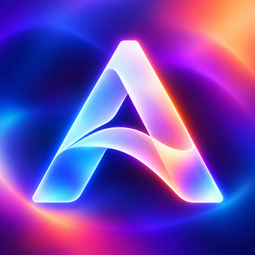
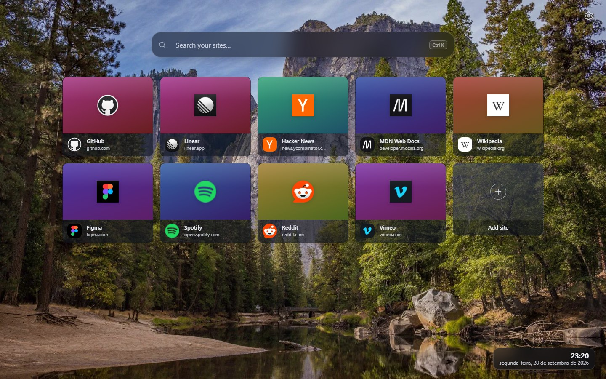
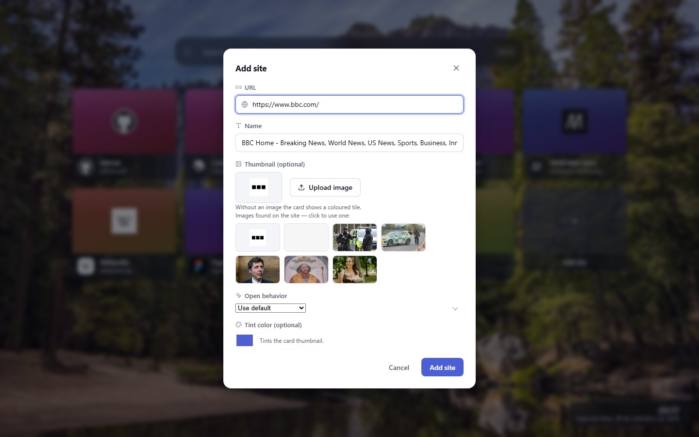
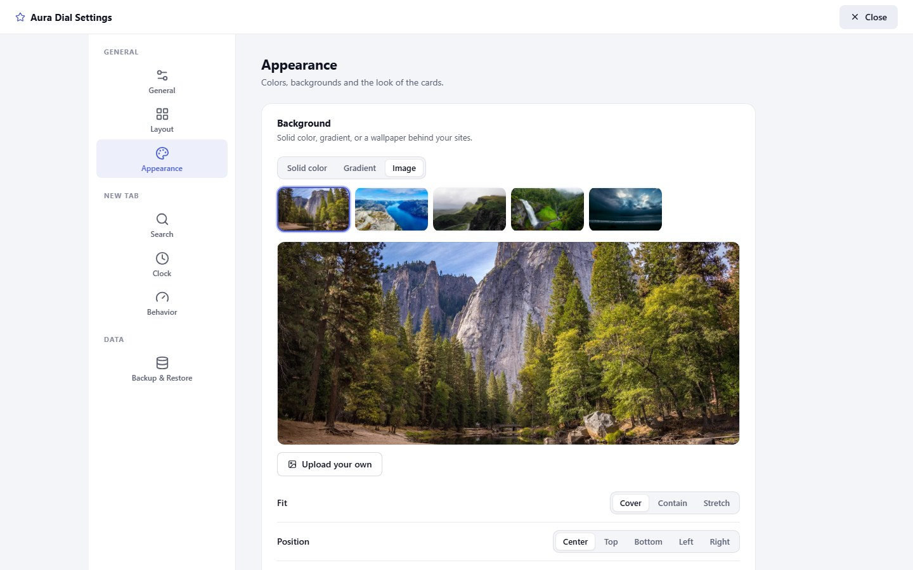
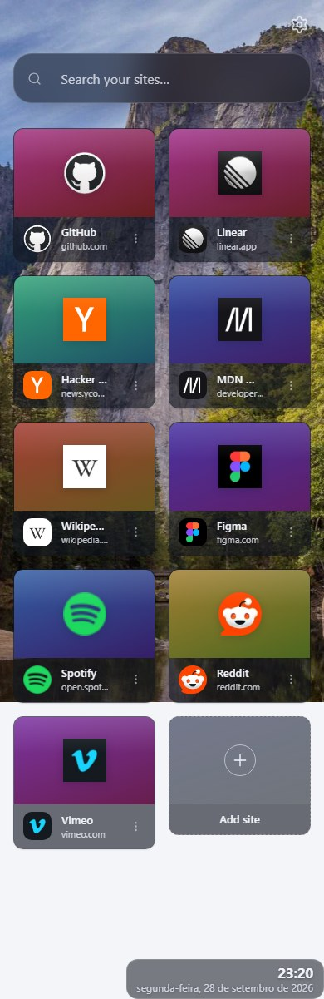

<div align="center">
  
  <h1>Aura Dial</h1>
  <p><strong>A modern, customizable speed dial that replaces your browser's new tab page.</strong><br>
  Manifest V3 · React 18 · TypeScript · Vite · Local-first — no accounts, no telemetry.</p>
</div>



## Features

### Your sites, on a grid

- **Speed dial grid** — every saved site is a card with a thumbnail, its icon, its name and its domain.
- **Drag & drop reordering** — the order is saved automatically.
- **Add site tile** — the last tile in the grid is always a shortcut to add another one.
- **Per-card menu** (⋮) — Open, Edit, Change image, Refresh favicon, Duplicate, Delete.
- **Undo** — deleting a card raises a toast with an undo action.

### Adding a site

Type (or paste) a URL and Aura Dial fetches what the page advertises:

- **Title** — `og:title` → `twitter:title` → `<title>`, falling back to the domain.
- **Icon** — the page's declared `<link rel="icon">`, then `/favicon.ico`, and finally the
  browser's own icon cache. If the site blocks all of that, the card shows the site's initial.
- **Thumbnail suggestions** — up to 6 images found on the page (`og:image`, `twitter:image`,
  then the largest `` elements), one click away. You can also upload your own image, pick
  the site icon as the thumbnail, or remove the choice entirely.
- **Open behavior per site** — same tab, new tab, background tab, new window, or incognito.
- **Tint color** — colors the tile behind the thumbnail.

### Finding things

- **Instant search** — filters your sites as you type; focus it from anywhere with `Ctrl` + `K`
  (`Cmd` + `K` on macOS). It can sit above or below the grid.
- **Keyboard navigation** — cards are focusable; `Enter` or `Space` opens the focused card,
  `Escape` closes menus and dialogs.
- **Clock & date** — optional, with a 24-hour toggle. The date is formatted in your browser's
  own locale.

### Making it yours

| Area | Options |
|---|---|
| Theme | Light, dark, or follow the system |
| Layout | Columns (auto, or 3–10), card size (small / medium / large / custom, with width and thumbnail-height sliders), horizontal and vertical gaps, grid alignment (centre, left, stretch) |
| Background | Solid color, two-color gradient (presets + direction), or an image: 11 built-in wallpapers, your own upload, fit (cover / contain / stretch), position, brightness, blur, and light or dark overlays |
| Cards | Corner radius, shadow (none / subtle / medium / large), frosted-glass effect, transparency |
| Card info | Show or hide site names, domains, and tooltips |
| Behavior | Default open behavior, confirm before deleting, animations on/off |
| Accessibility | Focus rings, `aria-label`s on controls, reduced-motion respected, animations can be turned off |

### Data you own

- **Backup & restore** — export everything (sites, icons as data URLs, all settings) to a single
  JSON file, then import it back with **replace** or **merge**.
- **Export links** — just your URLs, as JSON or as a bookmarks HTML file your browser can import.
- **Reset** — clears all data and restores the defaults, behind a confirmation.
- **Local-first** — everything lives in `chrome.storage.local`. Nothing is uploaded anywhere.

## Screenshots

| Add a site | Settings | Mobile |
|---|---|---|
|  |  |  |

## Install

### From the ZIP (no build tools)

1. Download **`aura-dial-extension.zip`** from the [latest release](../../releases/latest).
2. Unzip it into a folder you want to keep (the folder must contain `manifest.json`).
3. Open your browser's extension page — `edge://extensions` (Edge) or `chrome://extensions`
   (Chrome, Brave, Vivaldi, Opera, …).
4. Turn on **Developer mode**, click **Load unpacked**, and select the unzipped folder.
5. Open a new tab.

> Aura Dial is not published on the Chrome Web Store or Edge Add-ons yet, so loading the
> unpacked folder is the way to install it. It stays enabled while developer mode is on.

### From source

```bash
git clone https://github.com/rodrigocaetanooficial/aura-dial.git
cd aura-dial
npm install
npm run build          # type-checks, then bundles into dist/
```

Then load the **`dist/`** folder as an unpacked extension (same steps as above). After changing
the code, run `npm run build` again and hit the reload button on the extension card.

## Usage

1. **Add your first site** — click *Add your first site* in the empty state, or the
   `+ Add site` tile later on.
2. **Paste a URL** — the dialog fills in the title, the icon and image suggestions by itself.
3. **Pick a thumbnail** (optional) — click any suggested image, upload your own, or keep the
   plain tile with the site icon.
4. **Save** — the card joins the grid; drag it wherever you like.

Clicking a card opens the site. Every action lives in the card's ⋮ menu, or in **Settings**
(the gear in the top-right corner).

## Settings reference

- **General** — theme, and what each card shows (name, domain, tooltips).
- **Layout** — columns, card size, spacing, alignment.
- **Appearance** — background, wallpapers, card surface, corner radius, shadow, glass.
- **Search** — show/hide the search box and choose its position.
- **Clock** — clock, date and 24-hour format.
- **Behavior** — where links open, delete confirmation, animations.
- **Backup & Restore** — full backup, import, link export, reset.

Settings apply live: every change is saved as you make it.

## How the icons work

When you add a site, the icon is resolved in this order:

1. the `<link rel="icon">` / `apple-touch-icon` declared in the page,
2. `https://<domain>/favicon.ico`,
3. the browser's own favicon cache (via the `favicon` permission).

The first hit is stored with the site as a data URL (downscaled to 128 px so your storage stays
light). If all three fail — a bot wall, a private site, or a page with no icon at all — the card
shows the site's **initial** on a color derived from the domain, instead of a broken image or a
generic placeholder. *Refresh favicon* in the card menu re-runs the lookup.

## Permissions & privacy

| Permission | Why it's needed |
|---|---|
| `storage` | Saves your sites, images and settings in the browser's local storage. |
| `favicon` | Reads a site's icon from the browser's own cache as the last-resort fallback. |
| `host_permissions` (`http://*/*`, `https://*/*`) | Fetches the page you add or refresh to read its title, icon and candidate images. |

Aura Dial has **no server, no account and no analytics**. The only network requests it makes are
the ones you trigger: fetching a site's HTML and images when you add or refresh it, and loading
the thumbnails you picked. Everything else — including all your data — stays in your browser
profile. Uninstalling the extension removes the data with it.

## Development

```bash
npm install
npm run dev      # Vite dev server with preview harnesses (no browser APIs required)
npm run build    # tsc + vite build → dist/
npm run preview  # serve the production build
```

`npm run dev` serves two harnesses that mock `chrome.storage.local` with `localStorage` and seed
demo sites, so the whole UI can be worked on in a normal tab:

- `http://localhost:5173/preview.html` — the new tab page
- `http://localhost:5173/preview-options.html` — the settings page

### Project structure

```
public/manifest.json   Manifest V3 definition, icon set and permissions
src/components/        Grid, cards, add-site dialog, settings panel, toasts
src/pages/             NewTabPage (chrome_url_overrides.newtab) and OptionsPage
src/services/          Storage, favicon pipeline, backup/restore, link export
src/styles/            base.css (design tokens + shared UI), newtab.css, options.css
src/utils/             Theme → CSS variables, image resize, date/time formatting
docs/                  Logo and screenshots used by this README
```

### Technology

Manifest V3, React 18, TypeScript, Vite 5, lucide-react icons, plain CSS with custom properties
(no UI framework). The build output is a handful of small files and there are no runtime
dependencies beyond React.

## Known limitations

- **Blocked sites.** Pages behind bot protection (some stores and banks) won't hand over their
  HTML, so the title falls back to the domain, there are no image suggestions, and the card uses
  the site's initial if the icon can't be read either.
- **Icons need a reachable site.** A site that is offline or private has no icon to fetch.
- **Storage quota.** `chrome.storage.local` gives about 10 MB; uploaded images are downscaled to
  a 2560 px long edge to keep them inside it.
- **Incognito windows** require you to allow the extension in incognito mode
  (`edge://extensions` → *Details* → *Allow in InPrivate/Incognito*).
- **Chromium only.** Built for Manifest V3 browsers; Firefox and Safari are not supported.
- **Sample wallpapers** ship with the extension (artwork created for Aura Dial); drop your own
  images in `public/wallpapers/` and add them to `src/utils/wallpapers.ts` to change the set.

## Contributing

Issues and pull requests are welcome — see [CONTRIBUTING.md](CONTRIBUTING.md) for the dev setup
and what a good PR looks like.

## License

[MIT](LICENSE) © Rodrigo Caetano
